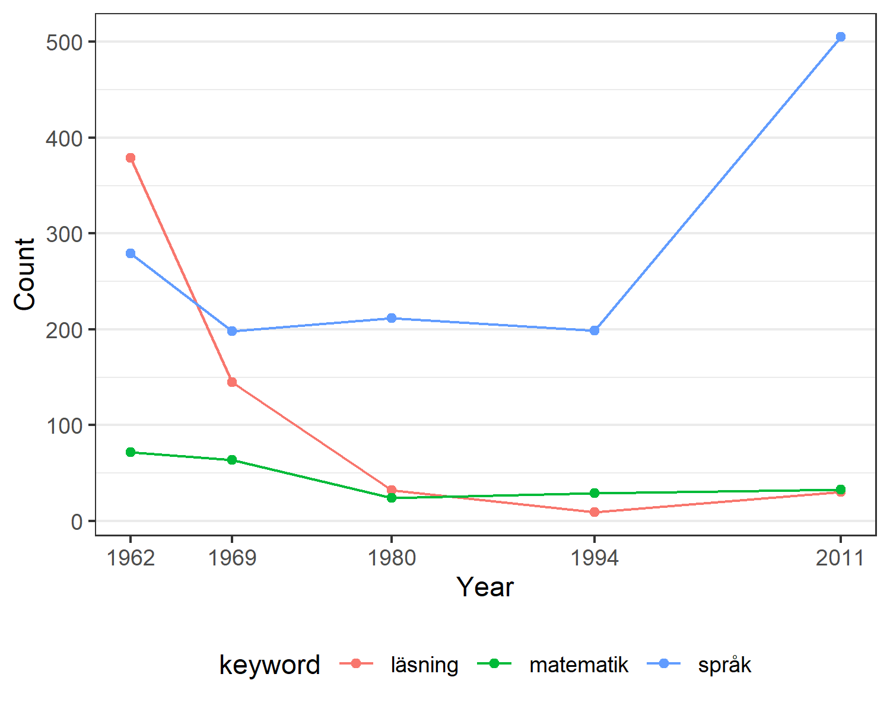

## Illustrative example

In this folder we select a few keywords and construct a figure showing their counts in each Läroplan.
The code is written in R and requires the `dplyr` and `ggplot2` packages.

### Details

The selected keywords are stored in [`keywords.csv`](keywords.csv).
We search for keywords using two approaches: 
- The 'wildcard' approach searches for any word that contains the keyword. For example, searching for `matematik` using the wildcard approach allows for variations of this word, such as `matematiken` and `matematiklektioner`.
- The 'exact' approach searches only for words that match the keyword exactly.

The code is stored in [`build.R`](build.R).
Run with `./example/` as working directory.

### Result

We show counts for each keyword using the 'wildcard' approach only.

